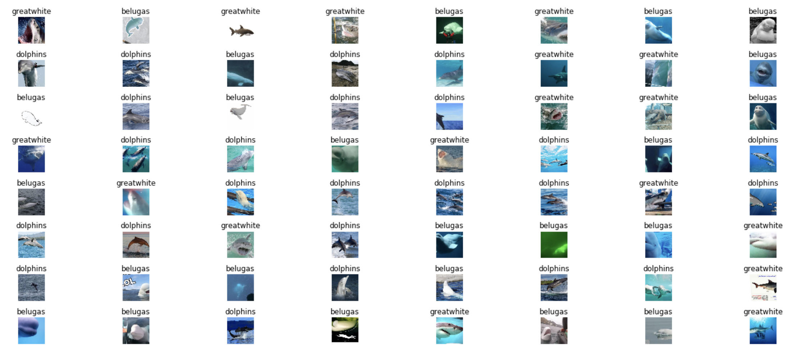
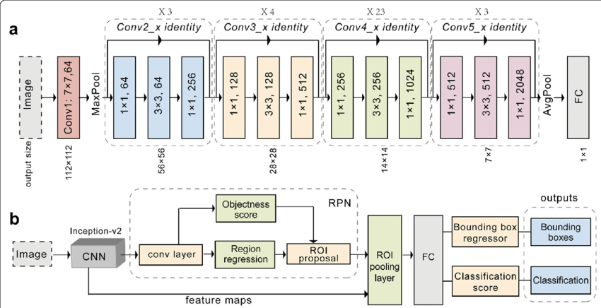
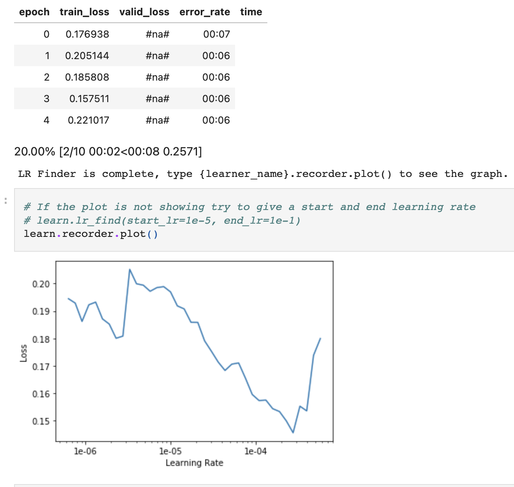
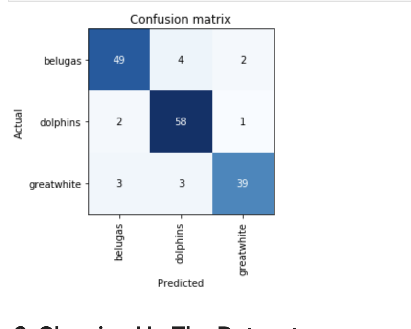
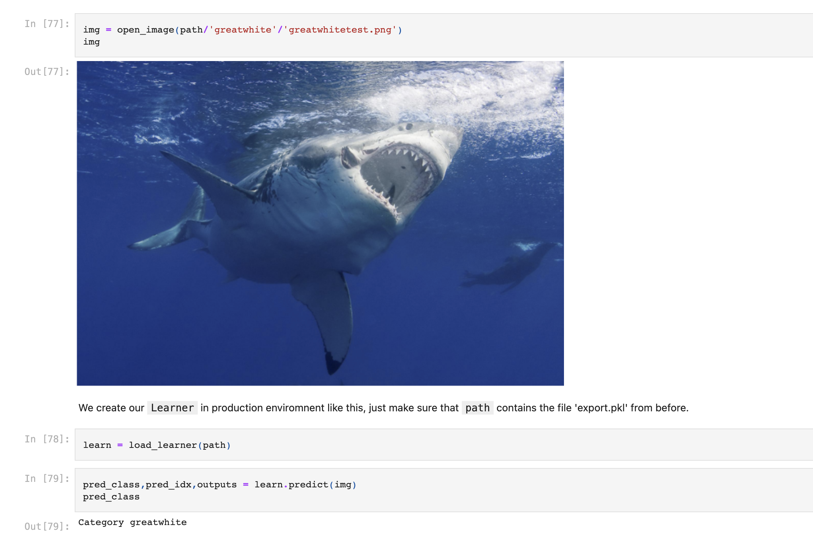

## Introduction

Monitoring the number of sharks, belugas and dolphins can be very useful for institutions that are concerned about climate change and species preservation. However, manually sifting through months of data can be time-consuming and labour intensive. Moreover, classifying aquatic animals poses several challenges such as background noises, distortion of images, the presence of other water bodies in images and occlusion [(Rathi et al., 2018)](https://arxiv.org/abs/1805.10106).

## Summary Of Strategy

Aquatic life classification can be automated with the use of convolutional neural networks (CNNs), which are machine learning algorithms suited for image classification. herefore, I decided to create 3 image datasets from Google Images, where each contained around 250 images of Belugas, Dolphins and Sharks. After I cleaned the datasets by removing irrelevant images, I trained a CNN with the data and it was able to classify the fish with a 90.6% accuracy on the test data set.

There is still room for improvement as this model could be improved with a larger data set, however, it still has some great use for saving time by automating manual classifications done by marine biologists in industry

## Dataset 

The data set was created using Google Images. Highly specific search queries were used whilst also negating some queries to help reduce time spent on data cleaning. i.e "dolphins" -belugas -sharks -. Moreover, the maximum number of images that Google can show is 700, hence we were limited by that constraint.

Once I had a page with reasonable results, I then proceeded to download the the images. This was done programmatically using some JavaScript code in my browser which saved the URLs of all the images I wanted in my data set.

Below is a screenshot of how the images were extacted: 

Below is a peak into the dataset: 

## Training

The model trained was a pre-trained resnet101 CNN model. Below is the architecture of the model:

Next is screenshot of the training process:

## Results 

The model achieved a 90.6% accuracy on the training set: 

## Conclusion

This model can be a useful tool in industry that can help preserve Dolphins, Belugas and Sharks. Future work would involve using larger datasets and potentially building applications that would enable the CNN models to make predictions at a larger scale.

